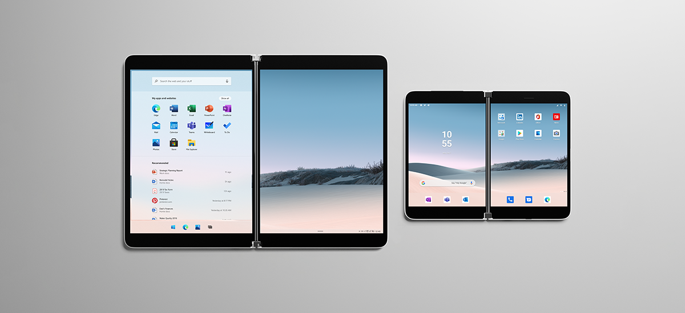
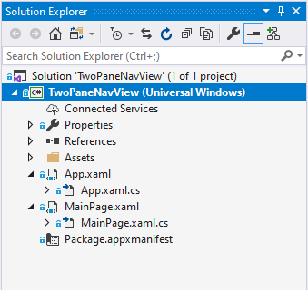
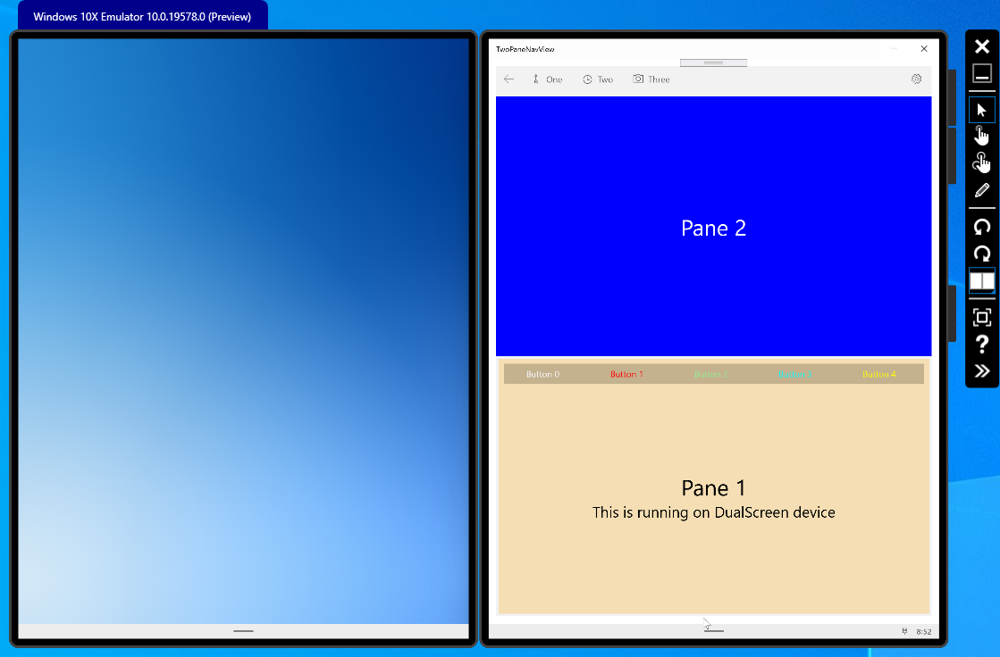
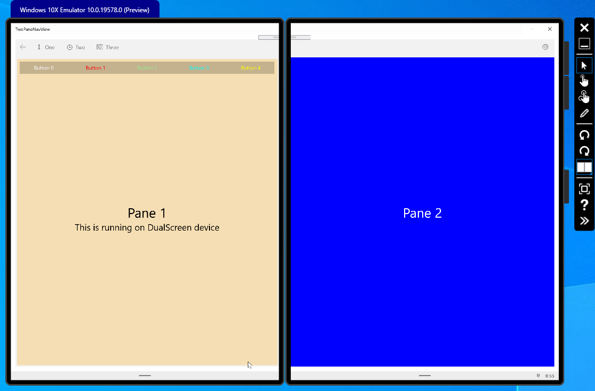
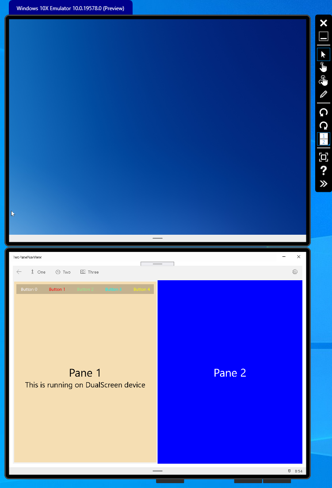

# TwoPaneNavView

## Windows Developer Incubation and Learning - Paula Scholz

## Introduction



A Universal Windows Platform sample that illustrates the [TwoPaneView](https://docs.microsoft.com/en-us/windows/uwp/design/controls-and-patterns/two-pane-view) layout control for [Dual-Screen experiences](https://docs.microsoft.com/en-us/dual-screen/introduction).

[TwoPaneView](https://docs.microsoft.com/en-us/windows/uwp/design/controls-and-patterns/two-pane-view) provides two distinct areas of content that can be spanned onto separate screens on dual-screen devices like the [Surface Neo](https://www.microsoft.com/en-us/surface/devices/surface-neo?&OCID=AID2000022_SEM_oCeJqLSf&msclkid=41672d2d892e1554df52734a51ae580b). `TwoPaneView` is the primary layout panel used to support dual-screen development for UWP applications.

While `TwoPaneView` is part of the Windows SDK, Microsoft recommends you use the version inside the [Windows UI](https://microsoft.github.io/microsoft-ui-xaml/) library, which provides updated versions of existing Windows platform controls.

## System Requirements

Development for dual-screen experiences requires
[Windows 10 version 10.0.18362](https://docs.microsoft.com/en-us/windows/uwp/whats-new/windows-10-build-18362) or better, along with its companion [Windows SDK](https://developer.microsoft.com/en-US/windows/downloads/windows-10-sdk/).  You also need [Windows UI](https://microsoft.github.io/microsoft-ui-xaml/) `version 2.4.0-prerelease-200203002` or better, available for installation through NuGet.

## Development Tools

Please refer to the [Windows 10x development tools](https://docs.microsoft.com/en-us/dual-screen/windows/get-dev-tools) guide.

You will need the latest version of [Visual Studio 2019](https://visualstudio.microsoft.com/downloads/). This sample was built with Visual Studio 2019 16.5.

You will also need the [Microsoft Emulator with the Windows 10x Emulator Image](https://blogs.windows.com/windowsdeveloper/2020/03/10/microsoft-emulator-and-windows-10x-emulator-image-preview-build-19578-available-now/) from the Microsoft Store, so that you may run this sample without an actual dual-screen device. 

The sample may also be run on desktop `Windows version 10.0.18362` or better without an emulator. In this case, it will appear as two seperate panes side by side.

## Using the Windows UI Library

To use the [Windows UI library](https://microsoft.github.io/microsoft-ui-xaml/) inside your dual-screen application, you must first install it from NuGet.  Right-click on your project file in the Visual Studio Solution Explorer to launch the NuGet tool.

Make sure you include the prerelease packages by selecting the checkbox.  You will need version `2.4.0-prerelease.20203002` or better.

Then, to use Windows UI Library controls rather than SDK controls, you will need to place a XamlControlsResources reference in your `App.xaml` Resource Dictionary.

For more details, please refer to the [Getting started with the Windows UI Library](https://docs.microsoft.com/en-us/uwp/toolkits/winui/getting-started) guide.


## Configuring your Emulator

You may need to configure your Win10x Emulator image.  Please refer to the [release notes](https://docs.microsoft.com/en-us/dual-screen/windows/release-notes#emulator-app) for the Windows 10x development tools.


## Debugging
You should follow this [guidance](https://docs.microsoft.com/en-us/dual-screen/windows/use-emulator#visual-studio-2019-preview) for debugging your Windows 10x UWP dual-screen apps.  

## Visual Studio Solution

The Visual Studio Solution is shown below:



`MainPage.xaml` contains the single Page and `TwoPaneView` control and serves as the core of the project.  

## TwoPaneView
The primary display layout panel for our application is [TwoPaneView](https://docs.microsoft.com/en-us/windows/uwp/design/controls-and-patterns/two-pane-view). This control provides a separate display surface `Pane` for each screen when the application is `spanned` across screens, and when the application is on a single screen these panes are displayed according to its `PanePriority`, `TallModeConfiguration` and `WideModeConfiguration` properties.  

`MainPage.xaml` is the single page in our solution.  On application startup, it appears like this:



At the top of the page, we see a [NavigationView](https://docs.microsoft.com/en-us/windows/uwp/design/controls-and-patterns/navigationview) which provides top-level navigation for a UWP app.  The top navigation style is shown and illustrates how you would place a `NavigationView` on the same page that hosts a `TwoPaneView`.  None of the `NavigationView` links are active in this demo.

Below this, we show `Pane2` of the `TwoPaneView` control, in a "BottomTop" [TallModeConfiguration](https://docs.microsoft.com/en-us/uwp/api/microsoft.ui.xaml.controls.twopaneview.tallmodeconfiguration?view=winui-2.3).  This pane is empty except for the `TextBox` label.

Finally, we have `Pane1` of the `TwoPaneView` control, which contains a row of [ToggleButton](https://docs.microsoft.com/en-us/uwp/api/Windows.UI.Xaml.Controls.Primitives.ToggleButton) controls, and two `TextBox` controls.

None of the `ToggleButton` controls are connected to a Click event handler, and are present to show how the size of UI elements may be adjusted to reflect device orientation as the user spans or rotates the device.  This happens in the `MainView_SizeChanged` event handler.

When the user spans this application across screens, the panes are displayed like this:



`Pane1` appears on the left-hand screen, and `Pane2` appears on the right.  

The XAML of MainPage looks like this:

```xaml
  <Page
    x:Class="TwoPaneNavView.MainPage"
    xmlns="http://schemas.microsoft.com/winfx/2006/xaml/presentation"
    xmlns:x="http://schemas.microsoft.com/winfx/2006/xaml"
    xmlns:local="using:TwoPaneNavView"
    xmlns:d="http://schemas.microsoft.com/expression/blend/2008"
    xmlns:mc="http://schemas.openxmlformats.org/markup-compatibility/2006"
    xmlns:MUXC="using:Microsoft.UI.Xaml.Controls"
    mc:Ignorable="d"
    Background="{ThemeResource ApplicationPageBackgroundThemeBrush}">

    <Grid Background="{ThemeResource SystemControlPageBackgroundChromeLowBrush}" Margin="12">
        <Grid.RowDefinitions>
            <RowDefinition Height="Auto" />
            <RowDefinition Height="*" />
        </Grid.RowDefinitions>
        
        <!-- This isn't hooked to anything, is just here to show how to insert it on top. -->
        <MUXC:NavigationView x:Name="NavViewControl" PaneDisplayMode="Top" Grid.Row="0" >
            <MUXC:NavigationView.MenuItems>
                <MUXC:NavigationViewItem Content="One" x:Name="One" Icon="Directions"/>
                <MUXC:NavigationViewItem Content="Two" x:Name="Two" Icon="Clock"/>
                <MUXC:NavigationViewItem Content="Three" x:Name="Three" Icon="Camera"/>
            </MUXC:NavigationView.MenuItems>
        </MUXC:NavigationView>
        
        <!-- We use BottomTop TallModeConfiguration to better show the ToggleButtons in Portrait. -->
        <MUXC:TwoPaneView x:Name="MainView" Grid.Row="1"
                    Pane1Length="1*"
                    Pane2Length="1*"
                    MinTallModeHeight="500"
                    MinWideModeWidth="700"
                    TallModeConfiguration="BottomTop"
                    WideModeConfiguration="LeftRight" >
            
            <MUXC:TwoPaneView.Pane1>
                <Grid Background="Wheat" x:Name="Pane1Grid" Padding="8" Margin="4">
                    <Grid.RowDefinitions>
                        <RowDefinition Height="Auto" />
                        <RowDefinition />
                    </Grid.RowDefinitions>
                    
                    <StackPanel Grid.Row="0" Orientation="Horizontal">
                        
                        <!-- The width of these ToggleButton objects is computed in MainView.SizeChanged event handler. -->
                        <ToggleButton Width="{x:Bind ButtonWidth, Mode=OneWay}" CornerRadius="0" >
                            <ToggleButton.Content>
                                <StackPanel Orientation="Horizontal">
                                    <TextBlock Text="Button 0" Margin="0,0,10,0" Foreground="GhostWhite" />
                                </StackPanel>
                            </ToggleButton.Content>
                        </ToggleButton>
                        
                        <ToggleButton Width="{x:Bind ButtonWidth, Mode=OneWay}" CornerRadius="0">
                            <ToggleButton.Content>
                                <StackPanel Orientation="Horizontal">
                                    <TextBlock Text="Button 1" Margin="0,0,10,0" Foreground="Red"/>
                                </StackPanel>
                            </ToggleButton.Content>

                        </ToggleButton>
                        
                        <ToggleButton Width="{x:Bind ButtonWidth, Mode=OneWay}" CornerRadius="0">
                            <ToggleButton.Content>
                                <StackPanel Orientation="Horizontal">
                                    <TextBlock Text="Button 2" Margin="0,0,10,0" Foreground="LightGreen"/>
                                </StackPanel>
                            </ToggleButton.Content>
                        </ToggleButton>
                        
                        <ToggleButton  Width="{x:Bind ButtonWidth, Mode=OneWay}" CornerRadius="0">
                            <ToggleButton.Content>
                                <StackPanel Orientation="Horizontal">
                                    <TextBlock Text="Button 3" Margin="0,0,10,0" Foreground="Cyan"/>
                                </StackPanel>
                            </ToggleButton.Content>
                        </ToggleButton>
                        
                        <ToggleButton Width="{x:Bind ButtonWidth, Mode=OneWay}" CornerRadius="0">
                            <ToggleButton.Content>
                                <StackPanel Orientation="Horizontal">
                                    <TextBlock Text="Button 4" Margin="0,0,10,0" Foreground="Yellow" />
                                </StackPanel>
                            </ToggleButton.Content>
                        </ToggleButton>
                        
                    </StackPanel>
                    
                    <StackPanel Grid.Row="1" HorizontalAlignment="Center" VerticalAlignment="Center">
                        <TextBlock x:Name="Pane1Text" Text="Pane 1" FontSize="36" Foreground="Black" HorizontalAlignment="Center"  />
                        <TextBlock x:Name="DeviceTypeText" Text="This is placeholder text." FontSize="24" Foreground="Black" HorizontalAlignment="Center"  />
                    </StackPanel>
                    
                </Grid>  
            </MUXC:TwoPaneView.Pane1>
            
            <MUXC:TwoPaneView.Pane2 >
                <Grid Background="Blue" x:Name="Pane2Grid">
                    <TextBlock x:Name="Pane2Text" Text="Pane 2" FontSize="36" Foreground="White" HorizontalAlignment="Center" VerticalAlignment="Center" />
                </Grid>                
            </MUXC:TwoPaneView.Pane2>
            
        </MUXC:TwoPaneView>
    </Grid>
</Page>
```
Note the `TallModeConfiguration` property of the `TwoPaneView` control is set to `BottomTop` to better illustrate the `ToggleButton` controls.

## Detecting Orientation and Spanned Status
The `MainPage_SizeChanged` event handler is fired whenever the size of the `MainPage` window changes; when the application is started, when the application is spanned by the user, and when the device is physically rotated to a new orientation (Portrait or Landscape).  This event handler contains a small state machine used to detect spanned or rotated status and saves these states to public `MainPage` properties.  

`TwoPaneView` applications always start in an unspanned state and spanning only occurs as a result of user action.  Spanning cannot be triggered programatically, by design.

The code looks like this:

```csharp    
        /// <summary>
        /// Fired when a rotation or spanning occurs. Dual-Screen experience windows
        /// are either maximized or minimized, there is no intermediate position.
        /// </summary>
        /// <param name="sender"></param>
        /// <param name="e"></param>
        private void MainPage_SizeChanged(object sender, SizeChangedEventArgs e)
        {
            Debug.WriteLine("MainPage_SizeChanged fired on Page object.");

            Debug.WriteLine(string.Format("Previous size: {0} width  {1} height", e.PreviousSize.Width, e.PreviousSize.Height));
            Debug.WriteLine(string.Format("New size: {0} width  {1} height", e.NewSize.Width, e.NewSize.Height));

            // determine orientation & spanning state without using ApplicationView object
            // through this little state machine

            // If the PreviousSize values are zero, then the NewSize
            // values are those at application launch.  If the app
            // is minimized and then maximized, the PreviousSize values
            // are whatever they were before minimized.  The app will
            // always be maximized at an unspanned state, regardless of
            // whether it was spanned before minimization.

            // this if clause determines the initial conditions
            if (e.PreviousSize.Width == 0 && e.PreviousSize.Height == 0)
            {
                // Right now, all we know is we started from application launch
                // and are unspanned. Let's determine whether or not we're 
                // Landscape or Portrait orientation.
                if (e.NewSize.Width < e.NewSize.Height)
                {
                    CurrentDisplayOrientation = DisplayOrientations.Portrait;
                }
                else
                {
                    CurrentDisplayOrientation = DisplayOrientations.Landscape;
                }

                // We always start out unspanned. Spanning is a result of user action.
                ApplicationIsSpanned = false;
            }
            else if (CurrentDisplayOrientation == DisplayOrientations.Portrait && !ApplicationIsSpanned)
            {
                // we're transitioning from Portrait-Unspanned to either Portrait-Spanned (spanning action)
                // or Landscape-Unspanned (rotation action)

                // If height does not change, we're going to Portrait-spanned
                if (e.PreviousSize.Height == e.NewSize.Height)
                {
                    ApplicationIsSpanned = true;
                }
                else
                {
                    // the height changed, we're now in Landscape unspanned
                    CurrentDisplayOrientation = DisplayOrientations.Landscape;
                }
            }
            else if (CurrentDisplayOrientation == DisplayOrientations.Landscape && !ApplicationIsSpanned)
            {
                // we're transitioning from Landscape-Unspanned to either Landscape-Spanned (spanning action)
                // or Portrait-Unspanned (rotation action)
                if (e.PreviousSize.Width == e.NewSize.Width)
                {
                    ApplicationIsSpanned = true;
                }
                else
                {
                    // the width changed, we're now in Portrait-Unspanned
                    CurrentDisplayOrientation = DisplayOrientations.Portrait;
                }
            }
            else if (CurrentDisplayOrientation == DisplayOrientations.Portrait && ApplicationIsSpanned)
            {
                // we're transitioning from Portrait-Spanned to either Portrait-Unspanned (spanning action)
                // or Landscape-Spanned (rotation action)
                if (e.PreviousSize.Height == e.NewSize.Height)
                {
                    ApplicationIsSpanned = false;
                }
                else
                {
                    // the height changed, we're now in Landscape-Spanned
                    CurrentDisplayOrientation = DisplayOrientations.Landscape;
                }
            }
            else if (CurrentDisplayOrientation == DisplayOrientations.Landscape && ApplicationIsSpanned)
            {
                // we're transitioning from Landscape-Spanned to either Landscape-Unspanned (spanning action)
                // or Portrait-Spanned (rotation action)
                if (e.PreviousSize.Width == e.NewSize.Width)
                {
                    ApplicationIsSpanned = false;
                }
                else
                {
                    // the width changed, we're now in Portrait-Spanned
                    CurrentDisplayOrientation = DisplayOrientations.Portrait;
                }
            }
        }
```

## Detect if running on DualScreen device 
At the time of writing (April, 2020), there is no "official" V1 SDK method for detecting whether or not an application is running on a DualScreen Win10x device or running on regular desktop Windows.  Because Win10x applications should not care whether or not they are running on the desktop or a DualScreen device, this capability was left out by design.  However, because V1 DualScreen devices share a common screen size configuration, this is easy to detect.  

We use the [ApplicationView](https://docs.microsoft.com/en-us/uwp/api/Windows.UI.ViewManagement.ApplicationView) class to query the number of `DisplayRegion` surfaces our device supports. DualScreen devices only have two of these.  As a sanity check, the sizes of these regions are compared with the known sizes of V1 DualScreen device screens.

```csharp
        /// <summary>
        /// Informal test to see if we're running on a DualScreen capable device
        /// or are running on desktop Windows. V1 SDK has no way to check this, so
        /// we resort to this informal method.
        /// </summary>
        /// <returns>True if on a DualScreen device</returns>
        public bool IsDualScreenDevice()
        {
            ApplicationView view = null;
            bool retValue = false;

            try
            {
                view = ApplicationView.GetForCurrentView();

                if (view != null)
                {
                    var dispRegions = view.WindowingEnvironment.GetDisplayRegions();

                    Debug.WriteLine(string.Format("There are {0} DisplayRegions reported in MainPage_Loaded", dispRegions.Count));

                    // DualScreen devices have exactly two display regions. If we don't have
                    // two regions, we're not on a DualScreen device.  Desktop PCs can also
                    // have two regions, so check their sizes also.  This is for V1 of the SDK!!!
                    if(dispRegions.Count == 2)
                    {
                        if( (dispRegions[1].WorkAreaOffset.X == 720 && dispRegions[1].WorkAreaSize.Height == 936) ||    // portrait
                            (dispRegions[1].WorkAreaOffset.Y == 720 && dispRegions[1].WorkAreaSize.Height == 696) )     // landscape
                        {
                            retValue = true;
                        }
                    }
                }
            }
            catch (Exception ex)
            {
                Debug.WriteLine("Exception {0}", ex.ToString());
            }

            return retValue;
        }
```
This method is called in the `MainPage_Loaded` event handler, like this:

```csharp
        /// <summary>
        /// Here, we check if we are on a DualScreen device
        /// </summary>
        /// <param name="sender"></param>
        /// <param name="e"></param>
        private void MainPage_Loaded(object sender, RoutedEventArgs e)
        {
            if(IsDualScreenDevice())
            {
                DeviceTypeText.Text = "This is running on DualScreen device";
            }
            else
            {
                DeviceTypeText.Text = "This is running on desktop Windows";
            }
        }
```

## Adjusting UI element sizes based on Device orientation

In the `MainView.Pane1` of our `TwoPaneView` object is a row of `ToggleButton` controls.  The width of these buttons must be adjusted in response to a spanning or orientation change.  This is done in the `MainView_SizeChanged` event handler of `TwoPaneView, like this:

```csharp
        /// <summary>
        /// Fired when the size of the TwoPaneView changes.  This is where we adjust
        /// UI element sizes within the TwoPaneView.
        /// </summary>
        /// <param name="sender"></param>
        /// <param name="e"></param>
        private void MainView_SizeChanged(object sender, SizeChangedEventArgs e)
        {
            Debug.WriteLine("MainView_SizeChanged fired on TwoPaneView object.");

            // need to adjust by the enclosing Grid's padding and margin values
            double tpvWidth = MainView.ActualWidth - Pane1Grid.Padding.Left - Pane1Grid.Padding.Right
                - Pane1Grid.Margin.Left - Pane1Grid.Margin.Right;

            if (CurrentDisplayOrientation == DisplayOrientations.Portrait && !ApplicationIsSpanned)
            {
                ButtonWidth = tpvWidth / _numberOfButtons;

                Debug.WriteLine("Portrait and not spanned");
                Debug.WriteLine(string.Format("MainView.ActualWidth = {0}", MainView.ActualWidth));
                Debug.WriteLine(string.Format("MainView.ActualHeight = {0}", MainView.ActualHeight));
                Debug.WriteLine(string.Format("ButtonWidth = {0}", ButtonWidth));
            }
            else if (CurrentDisplayOrientation == DisplayOrientations.Landscape && !ApplicationIsSpanned)
            {
                ButtonWidth = tpvWidth / (_numberOfButtons * 2);

                Debug.WriteLine("Landscape and not spanned");
                Debug.WriteLine(string.Format("MainView.ActualWidth = {0}", MainView.ActualWidth));
                Debug.WriteLine(string.Format("MainView.ActualHeight = {0}", MainView.ActualHeight));
                Debug.WriteLine(string.Format("ButtonWidth = {0}", ButtonWidth));
            }
            else if (CurrentDisplayOrientation == DisplayOrientations.Portrait && ApplicationIsSpanned)
            {
                ButtonWidth = tpvWidth / (_numberOfButtons * 2);

                Debug.WriteLine("Portrait and spanned");
                Debug.WriteLine(string.Format("MainView.ActualWidth = {0}", MainView.ActualWidth));
                Debug.WriteLine(string.Format("MainView.ActualHeight = {0}", MainView.ActualHeight));
                Debug.WriteLine(string.Format("ButtonWidth = {0}", ButtonWidth));
            }
            else if (CurrentDisplayOrientation == DisplayOrientations.Landscape && ApplicationIsSpanned)
            {
                ButtonWidth = tpvWidth / _numberOfButtons;

                Debug.WriteLine("Landscape and spanned");
                Debug.WriteLine(string.Format("MainView.ActualWidth = {0}", MainView.ActualWidth));
                Debug.WriteLine(string.Format("MainView.ActualHeight = {0}", MainView.ActualHeight));
                Debug.WriteLine(string.Format("ButtonWidth = {0}", ButtonWidth));
            }

            Debug.WriteLine("--------------------------------------------------------------");
        }
```
This width change is most evident when the `TwoPaneNavView` application is rotated from unspanned Portrait to unspanned Landscape, like this:



Note that the `ToggleButton` controls have a smaller width to fit inside the newly-resized `TwoPaneView.Pane1`.


